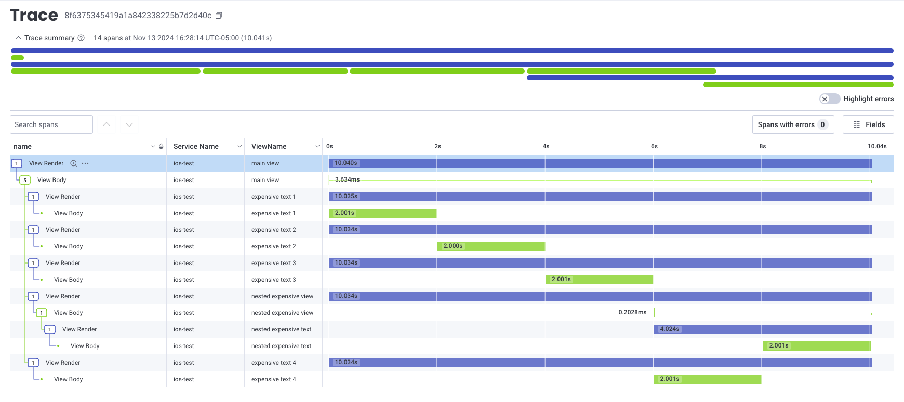

# Honeycomb OpenTelemetry Swift

[](https://github.com/honeycombio/home/blob/main/honeycomb-oss-lifecycle-and-practices.md)
[](https://circleci.com/gh/honeycombio/honeycomb-opentelemetry-swift)

Honeycomb wrapper for [OpenTelemetry](https://opentelemetry.io) on iOS and macOS.

**STATUS: this library is in BETA.** Data shapes are stable and safe for production. We are actively seeking feedback to ensure usability.

## Getting started

### Xcode

If you're using Xcode to manage dependencies...

  1. Select "Add Package Dependencies..." from the "File" menu.
  2. In the search field in the upper right, labeled “Search or Enter Package URL”, enter the Swift
     Honeycomb OpenTelemetry package url: https://github.com/honeycombio/honeycomb-opentelemetry-swift
  3. Add a project dependency on `Honeycomb`.

### Package.swift

If you're using `Package.swift` to manage dependencies...

1. Add the Package dependency.

```swift
    dependencies: [
        .package(url: "https://github.com/honeycombio/honeycomb-opentelemetry-swift.git",
                 from: "0.0.7")
    ],
```

2. Add the target dependency.

```swift
    dependencies: [
        .product(name: "Honeycomb", package: "honeycomb-opentelemetry-swift"),
    ],
```

### Initializing the SDK

To configure the SDK in your `App` class:
```swift
import Honeycomb

@main
struct ExampleApp: App {
    init() {
        do {
            let options = try HoneycombOptions.Builder()
                .setAPIKey("YOUR-API-KEY")
                .setServiceName("YOUR-SERVICE-NAME")
                .build()
            try Honeycomb.configure(options: options)
        } catch {
            NSException(name: NSExceptionName("HoneycombOptionsError"), reason: "\(error)").raise()
        }
    }
}
```

To manually send a span:
```swift
    let tracerProvider = OpenTelemetry.instance.tracerProvider.get(
        instrumentationName: "YOUR-INSTRUMENTATION-NAME",
        instrumentationVersion: nil
    )
    let span = tracerProvider.spanBuilder(spanName: "YOUR-SPAN-NAME").startSpan()
    span.end()
```

## Configuration Options

| Option               | Type                           | Required? | Description                                                                                                                                                |
|----------------------|--------------------------------|-----------|------------------------------------------------------------------------------------------------------------------------------------------------------------|
| `tracesAPIKey`       | String                         | No        | Dedicated API Key to use when sending traces.                                                                                                              |
| `metricsAPIKey`      | String                         | No        | Dedicated API Key to use when sending metrics.                                                                                                             |
| `logsAPIKey`         | String                         | No        | Dedicated API Key to use when sending logs.                                                                                                                |
| `dataset`            | String                         | No        | Name of Honeycomb dataset to send traces to. Required if sending to a classic Honeycomb environment.                                                       |
| `metricsDataset`     | String                         | No        | Name of Honeycomb dataset to send metrics to, instead of `dataset`.                                                                                        |
| `tracesEndpoint`     | String                         | No        | API endpoint to send traces to.                                                                                                                            |
| `metricsEndpoint`    | String                         | No        | API endpoint to send metrics to.                                                                                                                           |
| `logsEndpoint`       | String                         | No        | API endpoint to send trace to.                                                                                                                             |
| `sampleRate`         | Int                            | No        | Sample rate to apply (ie. a value of `40` means 1 in 40 traces will be exported).                                                                          |
| `debug`              | Boolean                        | No        | Enable debug logging.                                                                                                                                      |
| `serviceName`        | String?                        | No        | This determines the Honeycomb service to send data to, and also appears as the contents of the `service.name` resource attribute.|
| `serviceVersion`     | String?                        | No        | Current version of your application. Appears as the value of the `service.version` resource attribute.                                                     |
| `resourceAttributes` | Map<String, String>            | No        | Attributes to attach to outgoing resources.                                                                                                                |
| `headers`            | Map<String, String>            | No        | Headers to include on exported data.                                                                                                                       |
| `tracesHeaders`      | Map<String, String>            | No        | Headers to add to exported trace data.                                                                                                                     |
| `metricsHeaders`     | Map<String, String>            | No        | Headers to add to exported metrics data.                                                                                                                   |
| `logsHeaders`        | Map<String, String>            | No        | Headers to add to exported logs data.                                                                                                                      |
| `timeout`            | Duration                       | No        | Timeout used by exporter when sending data.                                                                                                                |
| `tracesTimeout`      | Duration                       | No        | Timeout used by traces exporter. Overrides `timeout` for trace data.                                                                                       |
| `metricsTimeout`     | Duration                       | No        | Timeout used by metrics exporter. Overrides `timeout` for metrics data.                                                                                    |
| `logsTimeout`        | Duration                       | No        | Timeout used by logs exporter. Overrides `timeout` for logs data.                                                                                          |
| `protocol`           | HoneycombOptions.OtlpProtocol  | No        | Protocol to use when sending data.                                                                                                                         |
| `tracesProtocol`     | HoneycombOptions.OtlpProtocol  | No        | Overrides `protocol` for trace data.                                                                                                                       |
| `metricsProtocol`    | HoneycombOptions.OtlpProtocol  | No        | Overrides `protocol` for metrics data.                                                                                                                     |
| `logsProtocol`       | HoneycombOptions.OtlpProtocol  | No        | Overrides `protocol` for logs data.                                                                                                                        |
| `spanProcessor`      | OpenTelemetryApi.SpanProcessor | No        | Additional span processor to use.                                                                                                                          |
| `sessionTimeout`     | TimeInterval                   | No        | Maximum length of time for a single user session. Used to generate `session.id` span attribute.                                                            |
| `metricKitInstrumentationEnabled`          | Bool     | No        | Whether to enable MetricKit instrumentation. (default: true)                                                                                               |
| `urlSessionInstrumentationEnabled`         | Bool     | No        | Whether to enable URLSession instrumentation. (default: true)                                                                                              |
| `uiKitInstrumentationEnabled`              | Bool     | No        | Whether to enable UIKit view instrumentation. (default: true)                                                                                              |
| `touchInstrumentationEnabled`              | Bool     | No        | Whether to enable UIKit touch instrumentation (default: false)                                                                                             |
| `unhandledExceptionInstrumentationEnabled` | Bool     | No        | Whether to enable unhandle exception instrumentation. (default: true)                                                                                      |
| `offlineCachingEnabled` | Bool | No | Whether to enable offline caching for telemetry (default: false). Warning: this feature is still in alpha and may be unstable. For more details, see [Offline Caching](#offline-caching) |

## Default Attributes
All spans will include the following attributes

- `honeycomb.distro.runtime_version`: Version of iOS on the device. See also `os.description`.
- `honeycomb.distro.version`: Version of the Honeycomb SDK being used.
- `os.description`: String containing iOS version, build ID, and SDK level.
- `os.name`: "iOS"
- `os.type`: "darwin"
- `os.version`: Current iOS Version
- `service.name`: The name of your application, as provided via `setServiceName()`, or inferred from your bundle if unset.
- `service.version`: Optional. The version of your application, as provided via `setServiceVersion(), or inferred from your bundle if unset.
- `telemetry.distro.version`: Version of the Honeycomb SDK being used.
- `telemetry.distro.name`: "honeycomb-opentelemetry-swift"
- `telemetry.sdk.language`: "swift"
- `telemetry.sdk.name`: "opentelemetry"
- `telemetry.sdk.version`: Version of the OpenTelemetry Swift SDK being used.
- [UIDevice](https://developer.apple.com/documentation/uikit/uidevice) attributes (only available on platforms where `UIKit` is available):
    - `device.id`: [UIDevice.identifierForVendor](https://developer.apple.com/documentation/uikit/uidevice/identifierforvendor)
    - `device.name` - [UIDevice.name](https://developer.apple.com/documentation/uikit/uidevice/name)
    - `device.systemName` - [UIDevice.systemName](https://developer.apple.com/documentation/uikit/uidevice/systemname)
    - `device.systemVersion` - [UIDevice.systemVersion](https://developer.apple.com/documentation/uikit/uidevice/systemversion)
    - `device.model` - [UIDevice.model](https://developer.apple.com/documentation/uikit/uidevice/model)
    - `device.localizedModel` - [UIDevice.localizedModel](https://developer.apple.com/documentation/uikit/uidevice/localizedmodel)
    - `device.userInterfaceIdiom` - [UIDevice.userInterfaceIdiom](https://developer.apple.com/documentation/uikit/uidevice/userinterfaceidiom)
    - `device.isMultitaskingSupported` - [UIDevice.isMultitaskingSupported](https://developer.apple.com/documentation/uikit/uidevice/ismultitaskingsupported)
    - `device.orientation` - [UIDevice.orientation](https://developer.apple.com/documentation/uikit/uidevice/orientation)
    - `device.isLowPowerModeEnabled` - If the user has Low Power Mode enabled on their device.
    - `device.isBatteryMonitoringEnabled` - [UIDevice.isBatteryMonitoringEnabled](https://developer.apple.com/documentation/uikit/uidevice/isbatterymonitoringenabled)
    - `device.batteryLevel` - [UIDevice.batteryLevel](https://developer.apple.com/documentation/uikit/uidevice/batterylevel). Only included if `UIDevice.current.batteryStateAttributesEnabled` is set to `true`.
    - `device.batteryState` - [UIDevice.batteryState](https://developer.apple.com/documentation/uikit/uidevice/batterystate-swift.property). Only included if `UIDevice.current.batteryStateAttributesEnabled` is set to `true`.

## Auto-instrumentation

The following auto-instrumentation libraries are automatically included:
* [MetricKit](https://developer.apple.com/documentation/metrickit) data is automatically collected.
* Some UIKit controls are automatically instrumented as described below.

### UIKit Instrumentation

#### Navigation

UIKit views will automatically be instrumented, emitting `viewDidAppear` and `viewDidDisappear` events. Both have the following attributes:

- `view.title` - Title of the view controller, if provided.
- `view.nibName` - The name of the view controller's nib file, if one was specified.
- `view.animated` - true if the transition to/from this view is animated, false if it isn't.
- `view.class` - name of the swift/objective-c class this view controller has.
- `screen.name` - name of the screen that appeared. In order of precedence, this attribute will have the value of the first of these to be set:
    - `accessiblityIdentifier` of the view that appeared
    - `view.title` - as defined above. If the view is a UINavigationController, Storybook Identifier (below) will be used in preference to `view.title`.
    - Storybook Identifier - unique id identifying the view controller within its Storybook.
    - `view.class` - as defined above
- `screen.path` - the full path leading to the current view, consisting of the current view's `screen.name` as well as any parent views.
    
`viewDidAppear` events will also track `screen.name` as the "current screen" (as with the manual instrumentation described below), and will include that value as `screen.name` on other, non-navigation spans emitted. 

#### Interaction

Various touch events are instrumented, such as:
* `Touch Began` - A touch started
* `Touch Ended` - A touch ended
* `click` - A "click". This is currently ony instrumented for `UIButton`s.

These events may have the following attributes. In the case of name attributes, we may walk up the view hierarchy to find a valid entry.
* `view.class`: e.g. `"UIButton"`
* `view.accessibilityIdentifier`, The `accessibilityIdentifier` property of a `UIView`, e.g. `"accessibleButton"`
* `view.accessibilityLabel` - The `accessibilityLabel` property of a `UIView`, e.g. `"Accessible Button"`
* `view.currentTitle` - The `currentTitle` property of a `UIButton`.
* `view.titleLabel.text` - The `text` of a `UIButton`'s `titleLabel`, e.g. `"Accessible Button"`
* `view.name`: The "best" available name of the view, given the other identifiers, e.g. `"accessibleButton"`

#### Session

The default session manager will create a new session on startup and will expire the session after a timeout. 
You can call `HoneycombOptions.setSessionTimeout` to set the timeout duration.

Spans will have the following attributes:
* `session.id` will be added to spans

To get the current session ID, call `Honeycomb.currentSession().id`.

You can subscribe to `.sessionStarted` and `sessionEnded` with `NotificationCenter` to be notified of session start and end events. 
For `.sessionStarted`:
* `userInfo["session"]` contains the session just created
* `userInfo["previousSession"]` contains the previous session or `nil` if there is no previous session. 
For `.sessionEnded`:
* `userInfo["previousSession"]` contains the session just ended.

#### Network
Network events on `URLSession` will automatically be instrumented. 

##### Trace Propagation 
If you are connecting your app to a backend service that you wish to view as a unified trace with your app, you
will need to manually add headers to all your outgoing requests. You must also create a span and set it as the active
span. The span's context will be used to generate the headers needed for trace propagation.

Below is an example of adding the headers to a network request.

```swift

import OpenTelemetryApi

private struct HttpTextMapSetter: Setter {
    func set(carrier: inout [String: String], key: String, value: String) {
        carrier[key] = value
    }
}

private let textMapSetter = HttpTextMapSetter()

func makeBackendRequest(data: Data) async throws {
    let url = URL(string: "https://mybackendservice")
    var request = URLRequest(url: url!)
    request.httpMethod = "POST"
    request.httpBody = data

    let allHeaders: [String: String] = []

    let span = OpenTelemetry.instance.tracerProvider.get(
        instrumentationName: "mybackendservice.network",
        instrumentationVersion: getCurrentAppVersion()
    )
    .spanBuilder(spanName: "backendRequest")
    // The span must be made the active span or else the network autoinstrumentation 
    // will not be attached to the trace.
    .setActive(true)
    .startSpan()
    defer {
        span.end()
    }

    // This will add the required headers to the `allHeaders` Dictionary
    OpenTelemetry.instance.propagators.textMapPropagator.inject(
        spanContext: span.context,
        carrier: &allHeaders,
        setter: textMapSetter
    )

    allHeaders.forEach({ (key: String, value: String) in
        request.setValue(value, forHTTPHeaderField: key)
    })

    let session = URLSession(configuration: URLSessionConfiguration.default)

    let (data, response) = try await session.data(for: request)

     // process your response data as normal
}
```

## Manual Instrumentation
### SwiftUI View Instrumentation

Wrap your SwiftUI views with `HoneycombInstrumentedView(name: String)`, like so:

```
var body: some View {
    HoneycombInstrumentedView(name: "main view") {
        VStack {
            // ...
        }
    }
}
```

This will measure and emit instrumentation for your View's render times, ex:



Specifically, it will emit 2 kinds of span for each view that is wrapped:

`View Render` spans encompass the entire rendering process, from initialization to appearing on screen. They include the following attributes:
- `view.name` (string): the name passed to `HoneycombInstrumentedView`
- `view.renderDuration` (double): amount of time to spent initializing the contents of `HoneycombInstrumentedView`
- `view.totalDuration` (double): amount of time from when `HoneycombInstrumentedView.body()` is called to when the contents appear on screen

`View Body` spans encompass just the `body()` call of `HoneycombInstrumentedView, and include the following attributes:
- `view.name` (string): the name passed to `HoneycombInstrumentedView` 

### SwiftUI Navigation Instrumentation
iOS 16 introduced two [new Navigation types](https://developer.apple.com/documentation/swiftui/migrating-to-new-navigation-types) that replace the now-deprecated [NavigationView](https://developer.apple.com/documentation/swiftui/navigationview).

We offer a convenience view modifier (`.instrumentNavigation(path: String)`) for cases where you are using a [`NavigationStack`](https://developer.apple.com/documentation/swiftui/navigationstack) and [managing navigation state externally](https://developer.apple.com/documentation/swiftui/navigationstack#Manage-navigation-state)

ex.:
```swift
import Honeycomb

struct SampleNavigationView: View {
    @State private var presentedParks: [Park] = [] // or var presentedParks = NavigationPath()

    var body: some View {
        NavigationStack(path: $presentedParks) {
            List(PARKS) { park in
                NavigationLink(park.name, value: park)
            }
            .navigationDestination(for: Park.self) { park in
                ParkDetails(park: park)
            }
        }
        .instrumentNavigation(path: presentedParks) // convenience View Modifier
    }
}
```  

Whenever the `path` variable changes, this View Modifier will emit a span with the name `NavigationTo`. This span will contain the following attributes:

- `screen.name` (string): the full navigation path when the span is emitted. If the path passed to the view modifier is not `Encodable` (ie. if you're using a `NavigationPath` and have stored a value that does not conform to the `Codable` protocol), then this attribute will have the value `<unencodable path>`.
- `navigation.trigger`: Normally `navigation`. May also be `appDidBecomeActive` if the app moves into the foreground and still has navigation context. 

If coming from another screen, we will also emit a `NavigationFrom` span with the following attributes:
- `screen.name` (string): the name of the previous screen.
- `screen.active.time` (double): time in seconds spent on that previous screen.
- `navigation.trigger`: Normally `navigation`. May also be `appWillResignActive`, `appDidEnterBackground`, or `appWillTerminate` if the navigation is due to the app closing. 

Note that navigation spans due to application lifecycle changes are only available on platforms with UIKit.

When using other kinds of navigation (ex. a `TabView` or `NavigationSplitView`), we offer a utility function `Honeycomb.setCurrentScreen(path: Any)`. This will immediately emit `NavigationTo` and `NavigationFrom` spans as documented above. As with the View Modifier form, if the `path` is `Encodable`, that will be included as an attribute on the span. Otherwise the `screen.name` attribute on the span will have the value `<unencodable path>`.

This function can be called from a view's `onAppear`, or inside a button's `action`, or wherever you decide to manage your navigation.

ex.:
```swift
struct ContentView: View {
    var body: some View {
        TabView {
            ViewA()
                .padding()
                .tabItem { Label("View A") }
                .onAppear {
                    Honeycomb.setCurrentScreen(path: "View A")
                }

            ViewB()
                .padding()
                .tabItem { Label("View B" }
                .onAppear {
                    Honeycomb.setCurrentScreen(path: "View B")
                }

            ViewC()
                .padding()
                .tabItem { Label("View C" }
                .onAppear {
                    Honeycomb.setCurrentScreen(path: "View C")
                }
        }
    }
}
```

Regardless of which form you use, either helper will keep track of the most recent path value, and our instrumentation includes a SpanProcessor that will automatically propage that value as a `screen.name` attribute onto any other spans.

This means that if you miss a navigation, you will see spans attributed to the wrong screen. For example:
```swift
struct ContentView: View {
    var body: some View {
        TabView {
            ViewA()
                .padding()
                .tabItem { Label("View A") }
                .onAppear {
                    Honeycomb.setCurrentScreen(path: "View A")
                }

            ViewB()
                .padding()
                .tabItem { Label("View B" }
                // no onAppear callback and no reportNavigation() call
        }
    }
}
``` 

In this case, since View B never reports the navigation, if the user navigates to `View A` and then to `View B`, any spans emitted from `View B` will still report `screen.name: "View A"`.

Both helpers also accept 2 optional parameters: `prefix: String` and `reason: String`:
- If the `prefix` parameter is provided, it will be prepended to the supplied path. This is useful to disambiguate between two different NavigationStacks within the same application.
- If the `reason` parameter is provided, it will be included as `navigation.trigger` on the `NavigateTo` and `NavigateFrom` spans. See included attributes above for more details on this attribute. 

### Manual Error Logging

Any Errors, NSErrors, or NSExceptions may be recorded as Log records using the `log` method. This can be used for logging 
any caught exceptions in your own code that will not be logged by our crash instrumentation.

Below is an example of logging an Error object using several custom attributes.

```swift
do {
    /// ...
}
catch let error {
    Honeycomb.log(
        error: error,
        attributes: [
            "user.name": AttributeValue.string(currentUser.name),
            "user.id": AttributeValue.int(currentUser.id)
        ],
        thread: Thread.current
    );
}
```

| Argument        | Type                               | Is Required | Description                                                                                                          |
|-----------------|------------------------------------|-------------|---------------------------------------------------------------------------------------------------------             |
| error/exception | Error/NSError/NSException          | true        | The error or exception itself. Depending on the type of error, fields will be automatically added to the log record. |
| attributes      | Dictionary<string, AttributeValue> | false       | Additional attributes you would like to log along with the default ones provided.                                    |
| thread          | Thread                             | false       | Thread where the error occurred. Add this to include additional attributes related to the thread                     |
| logger          | Logger                             | false       | Defaults to the Honeycomb error `Logger`. Provide if you want to use a different OpenTelemetry `Logger`              |


 ## Offline Caching

 Set the `offlineCachingEnabled` option to enable disk buffering for outgoing telemetry. This will cache your telemetry in the event of network failures and continue to retry exporting your telemetry for up to 18 hours. You will also see a minimum delay in exporting telemetry, of at least 5 seconds.

 This feature is currently in alpha and may be unstable. It is currently off by default.
